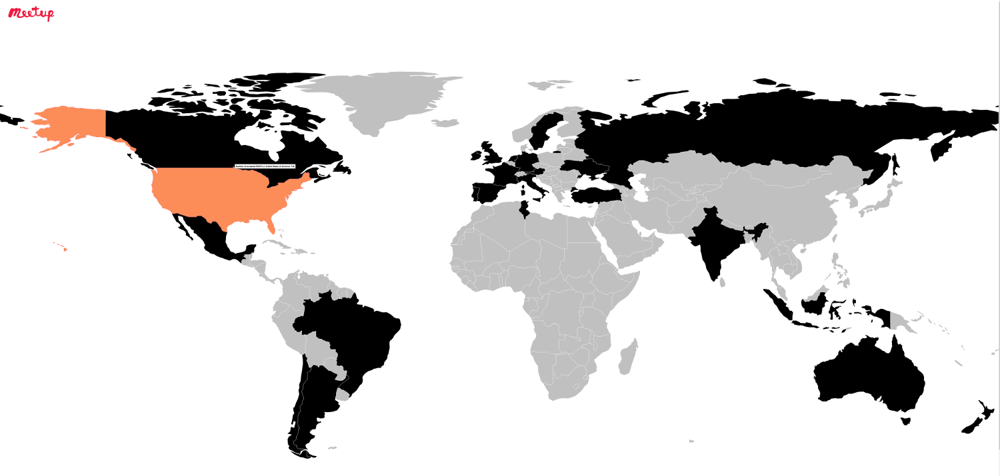

# Meetup.com RSVPs Application

The app consists of three components:

1. The **RSVP Producer** (written in python) which writes raw rsvps from the Meetup.com Rest API to a topic in kafka.

2. The **Spark Aggregator** which reads the raw rsvps from kafka and makes calculations using
the Spark structured streaming API and at the end it writes each udpated output to another kafka topic.

3. The **Visualization Play App** which reads the calculations from the kafka topic and depicts
the number of accepted RSVPS using [DataMaps](http://datamaps.github.io/).

## Local deployment

Start zookeeper and kafka. Example for kafka.
```nohup ~/kafka_2.11-0.11.0.1/bin/kafka-server-start.sh ~/kafka_2.11-0.11.0.1/config/server.properties > ~/kafka.log 2>&1 &
```

1) Start spark app:
```
./bin/spark-submit --master local[*] --class spark.streaming.examples.MeetUpRSVPAnalytics spark-streaming-examples-assembly-0.0.1-SNAPSHOT.jar \
 --bootstrapServers localhost:9092 --topic rsvp_read --write-topic counts --checkpointDir /tmp/c2
```
2) cd visual/play-visual
```
export RSVP_READ_TOPIC=counts
sbt run
```
3) run the the rsvp kafka producer
```
python RSVP_Producer.py --topic rsvp_read
```

To debug the app the following can be useful:

Read form a topic: bin/kafka-console-consumer.sh --zookeeper localhost:2181 --topic counts
Read output at the browser console using developer tools.


If everything was run succesfully you should see the following ouput at http://localhost:9000:



Hovering over a country gives you the number of accepted RSVPs so far. If a country is colored with silver then it has no RSVPs yet.

## DC/OS deployment

TBD
