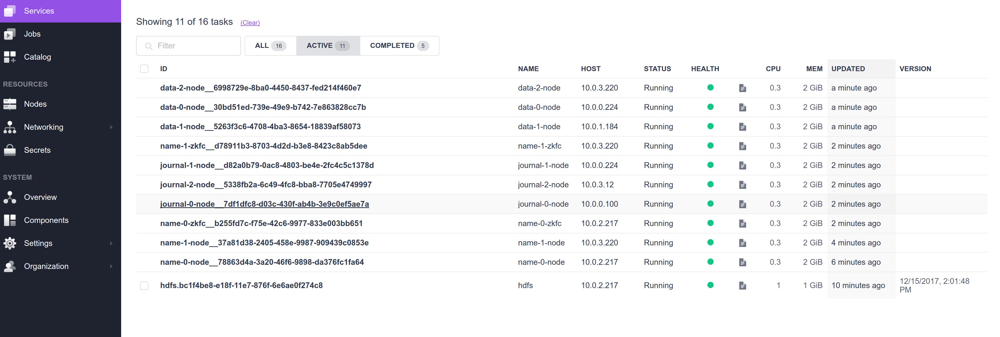
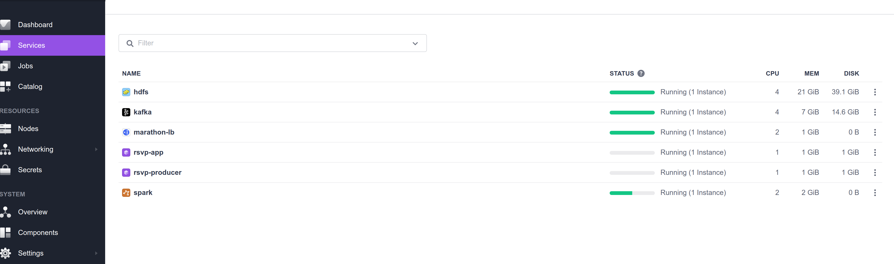
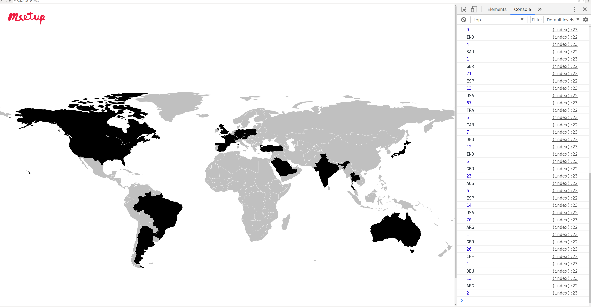

# Meetup.com RSVPs Application

The app consists of three components:

1. The **RSVP Producer** (written in python) which writes raw rsvps from the Meetup.com Rest API to a topic in kafka.

2. The **Spark Aggregator** which reads the raw rsvps from kafka and makes calculations using
the Spark structured streaming API and at the end it writes each udpated output to another kafka topic.

3. The **Visualization Play App** which reads the calculations from the kafka topic and depicts
the number of accepted RSVPS using [DataMaps](http://datamaps.github.io/).

## Local deployment

Start zookeeper and kafka. Example for kafka.
```nohup ~/kafka_2.11-0.11.0.1/bin/kafka-server-start.sh ~/kafka_2.11-0.11.0.1/config/server.properties > ~/kafka.log 2>&1 &
```

1) Start spark app:
```
./bin/spark-submit --master local[*] --class spark.streaming.examples.MeetUpRSVPAnalytics spark-streaming-examples-assembly-0.0.1-SNAPSHOT.jar \
 --bootstrapServers localhost:9092 --topic rsvp_read --write-topic counts --checkpointDir /tmp/c2
```
2) cd visual/play-app
```
export RSVP_READ_TOPIC=counts
sbt run
```
3) run the the rsvp kafka producer
```
python RSVP_Producer.py --topic rsvp_read
```

To debug the app the following can be useful:

Read form a topic: bin/kafka-console-consumer.sh --zookeeper localhost:2181 --topic counts
Read output at the browser console using developer tools.

If everything was run succesfully you should see the following ouput at http://localhost:9000:


Hovering over a country gives you the number of accepted RSVPs so far. If a country is colored with silver then it has no RSVPs yet.

## DC/OS deployment

### Build

1) Build image for the RSVP_Producer:

```
cd rsvp-producer
./build-image.sh --docker-username <username> --password <secret>

```

2) Build the spark aggregator jar and push it somewhere to make it accessible from
within the cluster. Eg.

```
cd spark-aggregator
sbt assembly
aws s3 cp target/scala-2.11/spark-rsvp-aggregator-assembly-1.0.0-SNAPSHOT.jar s3://<my-bucket> --acl public-read
```

3)  Build image for the visualization play app:

```
cd visual/docker
./build-image.sh --docker-username <username> --password <secret>

```

###

These steps assumes you have built the appropriate images and made your spark jar available within the
cluster with the previos step. Also assume that you have installed a dc/os cluster for example
by using a CF template: https://downloads.dcos.io/dcos/stable/aws.html and you have setup the DC/OS cli to connect to the cluster.

1) Install HDFS and Kafka from DC/OS catalog or using the dcos cli as follows:

dcos package install kafka --yes
dcos package install hdfs --yes

Hdfs takes time to install (~10 minutes). You should see 
when installation is finished on the UI.

2) Install Spark with hdfs support:

```
dcos package install --options=options.json spark
```
where options.json:
```
{
  "hdfs": {
    "config-url": "http://api.hdfs.marathon.l4lb.thisdcos.directory/v1/endpoints"
  }
}
```

3) Install marathon lb if you want to access the play app from a public node.

dcos package install marathon-lb --yes

If everything went ok you should see the following 

4) Launch each component:

Spark Aggregator:


  ```
  dcos spark run --submit-args="--driver-cores 1 --conf spark.cores.max=4 --driver-memory 1024M  --class spark.streaming.examples.MeetUpRSVPAnalytics https://.../spark-rsvp-aggregator-assembly-1.0.0-SNAPSHOT.jar \
 --bootstrapServers broker.kafka.l4lb.thisdcos.directory:9092 --topic rsvp_reads --write-topic rsvp_counts --checkpointDir hdfs://hdfs/checkpoint"
 ```

  RSVP producer:
  ```
  dcos marathon app add rsvp-producer.json
  ```

  Visual app:

  ```
  dcos marathon app add visual.json
  ```

5) Access the play app either on a public node or via the agent where it runs on
if you are using VPN.

Note: to find your public agent follow the instructions here: https://dcos.io/docs/1.10/administering-clusters/locate-public-agent/

```
for id in $(dcos node --json | jq --raw-output '.[] | select(.attributes.public_ip == "true") | .id'); do dcos node ssh --option StrictHostKeyChecking=no --option LogLevel=quiet --master-proxy --mesos-id=$id "curl -s ifconfig.co" ; done 2>/dev/null
34.242.186.195
```
You should see the earth map here: https://34.242.186.195:10000 and data updates logged
in the . At the top you can also see the ip we use to access the visual app.

TODO: Add health checks and try DC/COS strict mode (kerberos support).
This app was tested on DC/OS 1.10 OSS/permissive modes.
